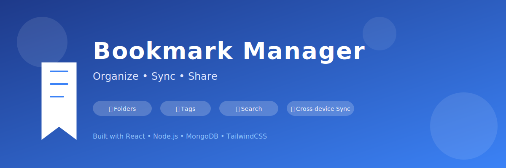

# Bookmark Manager

A web-based application for managing bookmarks with advanced organization features, authentication, and cross-device sync.

## Features

- **User Authentication**: Secure registration and login with JWT
- **Bookmark Management**: Add, edit, and delete bookmarks with metadata
- **Tag Management**: Organize bookmarks with customizable tags and bulk editing
- **Folder System**: Hierarchical folder organization with drag-and-drop functionality
- **Advanced Search**: Filter bookmarks by tags, keywords, and dates
- **Font Customization**: Adjust font settings with Google Fonts integration
- **Metadata Extraction**: Automatically fetches titles, descriptions and favicons
- **Import/Export**: Import bookmarks from browsers or export for backup
- **Browser Extension**: Add bookmarks directly from Chrome/Firefox with enhanced popup UI and context menu; now supports pre-filling bookmark forms with current page information when not logged in
- **Bookmarklet**: Add bookmarks from any webpage with a single click using the bookmarklet

## Getting Started

### Prerequisites
- Node.js v20+
- MongoDB (automatically handled via Docker)
- Docker (for local MongoDB setup)

### Database Setup Information
When you first clone and set up this application, here's what you need to know about the database:

- **Automatic Schema Creation**: The database schema is automatically created by Mongoose ODM when the application first connects to MongoDB. You don't need to manually create collections or define schemas.
- **Docker Container**: The project includes a `start-mongo.sh` script that automatically creates and manages a MongoDB Docker container for you.
- **Persistent Storage**: The Docker container is configured to persist data in `~/mongodb` so your bookmarks and user data remain even if the container stops.
