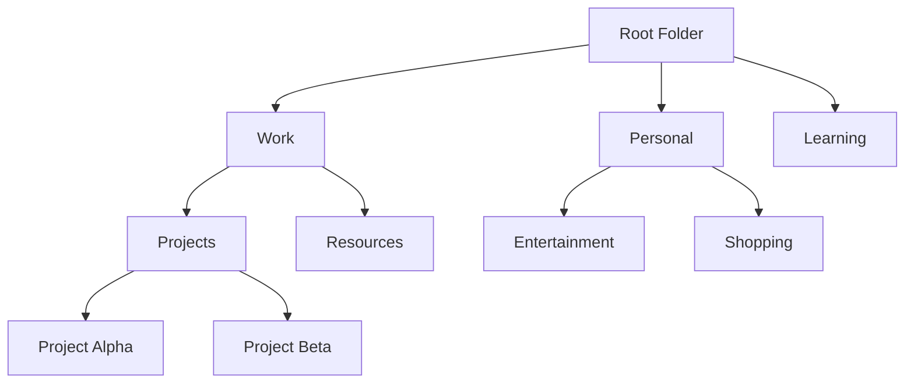

# Folder Implementation Plan

## Overview

This document outlines a comprehensive plan for implementing a hierarchical folder/collection system for organizing bookmarks. The system will support nested folders, drag-and-drop functionality, and seamless integration with the existing tag-based organization.

**Current Status: 70% Complete - Backend fully implemented, frontend in development**

This implementation aims to enhance bookmark organization by:
1. Providing a familiar hierarchical structure similar to browser bookmarks
2. Enabling import/export compatibility with browser bookmark systems
3. Supporting both folder-based and tag-based organization simultaneously
4. Facilitating easy reorganization through drag-and-drop functionality

## Implementation Status

### ✅ Completed (Backend Infrastructure)
- [x] Database schema design and implementation
- [x] Folder model with hierarchical structure
- [x] Complete folder CRUD API endpoints
- [x] Bookmark model updates with folder references
- [x] Folder validation and authorization middleware
- [x] Bulk move operations for bookmarks
- [x] Folder bookmark count tracking
- [x] Circular reference prevention
- [x] Cascade delete functionality
- [x] Database indexes for performance

### 🔄 In Progress (Frontend Development)
- [ ] Folder tree navigation component
- [ ] Folder management UI components
- [ ] Folder selection in bookmark forms
- [ ] Folder breadcrumb navigation
- [ ] Drag-and-drop functionality

### 📋 Planned (Advanced Features)
- [ ] Browser bookmark import/export with folder structure
- [ ] Smart folders based on criteria
- [ ] Folder templates and presets
- [ ] Folder sharing permissions
- [ ] Advanced folder analytics

## System Architecture

### Data Model Design

The folder system uses a tree structure with the following components:



### Database Schema (✅ Implemented)

#### Folder Model
```javascript
const folderSchema = new mongoose.Schema({
  name: { 
    type: String, 
    required: true,
    trim: true,
    maxlength: 100
  },
  description: { 
    type: String,
    trim: true,
    maxlength: 500
  },
  parent: { 
    type: mongoose.Schema.Types.ObjectId, 
    ref: 'Folder',
    default: null 
  },
  owner: { 
    type: mongoose.Schema.Types.ObjectId, 
    ref: 'User',
    required: true 
  },
  isRoot: { 
    type: Boolean, 
    default: false 
  },
  order: { 
    type: Number, 
    default: 0 
  },
  color: { 
    type: String, 
    default: '#3B82F6',
    match: /^#([A-Fa-f0-9]{6}|[A-Fa-f0-9]{3})$/
  },
  icon: { 
    type: String, 
    default: 'folder',
    maxlength: 50
  },
  bookmarkCount: {
    type: Number,
    default: 0
  },
  createdAt: { 
    type: Date, 
    default: Date.now 
  },
  updatedAt: { 
    type: Date, 
    default: Date.now 
  }
});
```

#### Bookmark Model Updates (✅ Implemented)
```javascript
// Added folder reference to existing bookmark schema
folder: { 
  type: mongoose.Schema.Types.ObjectId, 
  ref: 'Folder',
  default: null 
}
```

## API Endpoints (✅ Completed)

### Folder Endpoints
```
GET    /api/folders           - Get user's folder tree
GET    /api/folders/:id       - Get specific folder details
POST   /api/folders           - Create new folder
PUT    /api/folders/:id       - Update folder
DELETE /api/folders/:id       - Delete folder (with cascade handling)
GET    /api/folders/:id/bookmarks - Get bookmarks in folder
POST   /api/folders/:id/move  - Move folder to new parent
```

### Updated Bookmark Endpoints (✅ Completed)
```
GET    /api/bookmarks?folder=:id - Filter bookmarks by folder
POST   /api/bookmarks            - Support folder assignment
PUT    /api/bookmarks/:id        - Support folder reassignment
POST   /api/bookmarks/move       - Move multiple bookmarks to folder
```

## Frontend Implementation Plan

### Phase 1: Core Components (Current Focus)
1. **FolderTree Component** - Hierarchical folder display
   - Collapsible/expandable nodes
   - Visual indicators for nested levels
   - Context menu for folder actions
   - Folder icons with color coding

2. **FolderManager Component** - Folder CRUD interface
   - Create, edit, delete folders
   - Folder color and icon selection
   - Folder description management

3. **FolderSelector Component** - Folder selection dropdown
   - Used in bookmark add/edit forms
   - Hierarchical folder display
   - Quick folder creation option

### Phase 2: Navigation & Integration
1. **FolderBreadcrumb Component** - Navigation breadcrumbs
2. **Update BookmarkGrid** - Show folder information
3. **Update Dashboard** - Integrate folder navigation
4. **Folder-based routing** - URL structure for folders

### Phase 3: Advanced Features
1. **Drag-and-drop functionality**
2. **Bulk folder operations**
3. **Folder search and filtering**
4. **Browser import/export**

## Current Backend Implementation Details

### Folder Routes (✅ Complete)
- Full CRUD operations with proper authorization
- Hierarchical tree building and traversal
- Bookmark count tracking and updates
- Circular reference prevention
- Cascade delete with bookmark handling

### Bookmark Integration (✅ Complete)
- Folder filtering in bookmark queries
- Bulk move operations with validation
- Folder ownership verification
- Automatic bookmark count updates

### Database Optimizations (✅ Complete)
- Indexes on folder queries
- Efficient tree traversal queries
- Optimized bookmark-folder associations

## Next Steps (Frontend Development)

### Immediate Tasks
1. Create FolderTree component with basic navigation
2. Implement FolderManager for CRUD operations
3. Add folder selection to bookmark forms
4. Update Dashboard to show folder statistics

### Integration Tasks
1. Connect folder context to existing bookmark context
2. Add folder-based filtering to search functionality
3. Implement folder breadcrumb navigation
4. Update bookmark display to show folder information

### Advanced Features
1. Implement drag-and-drop for reorganization
2. Add folder import/export functionality
3. Create smart folder capabilities
4. Add folder sharing permissions

## Testing Strategy

### Backend Tests (✅ Completed)
- Unit tests for folder model
- API endpoint tests
- Authorization tests
- Data validation tests
- Circular reference prevention tests

### Frontend Tests (Planned)
- Component rendering tests
- User interaction tests
- Folder navigation tests
- Error handling tests
- Drag-and-drop functionality tests

## Performance Considerations

### Database Optimization (✅ Implemented)
- Index folder paths for quick traversal
- Efficient nested folder queries
- Optimized bookmark count tracking
- Proper query projection

### Frontend Optimization (Planned)
- Lazy load folder contents
- Virtual scrolling for large lists
- Debounce folder search
- Cache folder data locally
- Efficient tree rendering

---
Last Updated: 2025-01-27 by Documentation Agent
