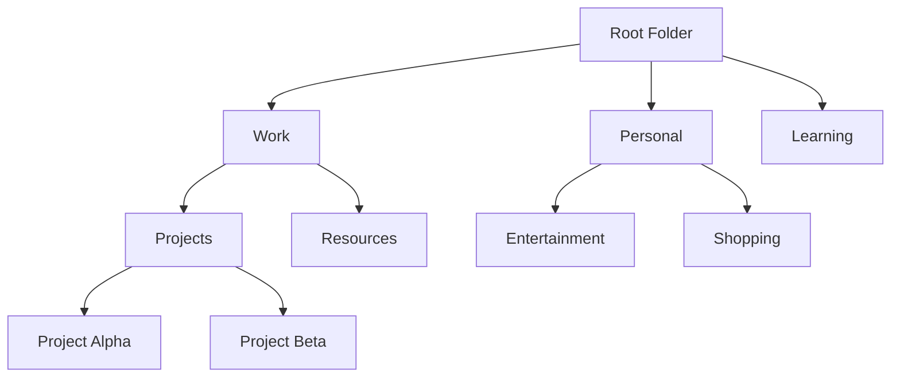

# Folder Implementation Plan

## Overview

This document outlines a comprehensive plan for implementing a hierarchical folder/collection system for organizing bookmarks. The system will support nested folders, drag-and-drop functionality, and seamless integration with the existing tag-based organization.

This implementation aims to enhance bookmark organization by:
1. Providing a familiar hierarchical structure similar to browser bookmarks
2. Enabling import/export compatibility with browser bookmark systems
3. Supporting both folder-based and tag-based organization simultaneously
4. Facilitating easy reorganization through drag-and-drop functionality

## System Architecture

### Data Model Design

The folder system will use a tree structure with the following components:



### Database Schema

#### Folder Model
```javascript
const folderSchema = new mongoose.Schema({
  name: { 
    type: String, 
    required: true,
    trim: true,
    maxlength: 100
  },
  description: { 
    type: String,
    trim: true,
    maxlength: 500
  },
  parent: { 
    type: mongoose.Schema.Types.ObjectId, 
    ref: 'Folder',
    default: null 
  },
  owner: { 
    type: mongoose.Schema.Types.ObjectId, 
    ref: 'User',
    required: true 
  },
  isRoot: { 
    type: Boolean, 
    default: false 
  },
  order: { 
    type: Number, 
    default: 0 
  },
  color: { 
    type: String, 
    default: '#3B82F6',
    match: /^#([A-Fa-f0-9]{6}|[A-Fa-f0-9]{3})$/
  },
  icon: { 
    type: String, 
    default: 'folder',
    maxlength: 50
  },
  bookmarkCount: {
    type: Number,
    default: 0
  },
  createdAt: { 
    type: Date, 
    default: Date.now 
  },
  updatedAt: { 
    type: Date, 
    default: Date.now 
  }
});
```

#### Bookmark Model Updates
```javascript
// Add folder reference to existing bookmark schema
folder: { 
  type: mongoose.Schema.Types.ObjectId, 
  ref: 'Folder',
  default: null 
}
```

## Implementation Phases

### Phase 1: Backend Infrastructure (Weeks 1-2)
1. **Create Folder Model** - Define and implement the Folder schema
2. **Create Folder Routes** - RESTful API endpoints for folder CRUD operations
3. **Update Bookmark Routes** - Modify existing bookmark endpoints to support folder association
4. **Add Folder Validation** - Ensure proper authorization and data validation
5. **Create Folder Service Layer** - Business logic for folder operations

### Phase 2: Frontend Data Management (Weeks 3-4)
1. **Create Folder API Service** - Frontend utilities for folder operations
2. **Update Bookmark API Service** - Extend bookmark API calls to support folders
3. **Create Folder State Management** - React hooks/context for folder data
4. **Add Folder Data Fetching** - Integrate folder loading into app initialization

### Phase 3: UI Components (Weeks 5-6)
1. **Create Folder Tree Component** - Hierarchical folder navigation
2. **Create Folder Management UI** - Add/edit/delete folder interfaces
3. **Update Bookmark Components** - Modify forms to include folder selection
4. **Create Folder Breadcrumb** - Navigation trail for current folder path
5. **Add Folder Icons and Colors** - Visual customization options

### Phase 4: Advanced Features (Weeks 7-8)
1. **Drag and Drop** - Move bookmarks and folders via drag-and-drop
2. **Folder Search** - Search within specific folders
3. **Bulk Operations** - Move multiple bookmarks to folders
4. **Browser Import/Export** - Compatibility with browser bookmark formats
5. **Folder Sharing** - Share entire folders with other users

## Detailed Implementation Steps

### 1. Database Schema Implementation
- [x] Create `models/Folder.js` with the folder schema
- [x] Update `models/Bookmark.js` to include folder reference
- [ ] Create database migration script for existing bookmarks
- [x] Add indexes for folder queries
- [x] Implement circular reference prevention
- [x] Add cascade delete functionality

### 2. Backend API Development
- [x] Create `routes/folders.js` with CRUD endpoints
- [x] Implement GET /api/folders - Get user's folder tree
- [x] Implement GET /api/folders/:id - Get specific folder details
- [x] Implement POST /api/folders - Create new folder
- [x] Implement PUT /api/folders/:id - Update folder
- [x] Implement DELETE /api/folders/:id - Delete folder (with cascade handling)
- [x] Implement GET /api/folders/:id/bookmarks - Get bookmarks in folder
- [x] Implement POST /api/folders/:id/move - Move folder to new parent
- [x] Update `routes/bookmarks.js` to support folder filtering
- [x] Add folder validation middleware
- [x] Implement folder ownership checks

### 3. Frontend Services
- [ ] Create `src/utils/folderApi.js` - Folder API service
- [ ] Update `src/utils/api.js` - Extend bookmark API calls
- [ ] Create `src/hooks/useFolders.js` - React hook for folder data
- [ ] Create `src/contexts/FolderContext.jsx` - Global folder state
- [ ] Implement folder caching strategy

### 4. UI Components Development
- [ ] Create `src/components/FolderTree.jsx` - Hierarchical folder display
- [ ] Create `src/components/FolderManager.jsx` - Folder CRUD interface
- [ ] Create `src/components/FolderSelector.jsx` - Folder selection dropdown
- [ ] Create `src/components/FolderBreadcrumb.jsx` - Navigation breadcrumbs
- [ ] Create `src/components/FolderActions.jsx` - Folder action buttons
- [ ] Create `src/components/FolderEmptyState.jsx` - Empty folder display
- [ ] Update `src/components/AddBookmarkForm.jsx` - Add folder selection
- [ ] Update `src/components/EditBookmarkForm.jsx` - Add folder editing
- [ ] Update `src/components/BookmarkList.jsx` - Show folder information

### 5. Integration and State Management
- [ ] Update `src/App.jsx` to include folder context
- [ ] Modify bookmark filtering to support folder-based filtering
- [ ] Add folder-based routing (e.g., /folder/:folderId)
- [ ] Implement folder-based bookmark display
- [ ] Add folder creation from bookmark form
- [ ] Implement folder state persistence

### 6. User Experience Enhancements
- [ ] Add folder creation inline in bookmark forms
- [ ] Implement folder color coding
- [ ] Add folder statistics (bookmark count)
- [ ] Create folder empty state messages
- [ ] Add folder search/filter functionality
- [ ] Implement folder sorting options
- [ ] Add keyboard shortcuts for folder navigation

### 7. Browser Integration
- [ ] Implement bookmark import from browser (HTML format)
- [ ] Implement bookmark export to browser (HTML format)
- [ ] Create browser extension folder sync functionality
- [ ] Add folder path display in browser extension
- [ ] Implement folder selection in browser extension popup

### 8. Advanced Features
- [ ] Implement drag-and-drop for bookmark reorganization
- [ ] Add folder move operations (change parent)
- [ ] Create folder templates for common structures
- [ ] Add folder export functionality
- [ ] Implement folder sharing permissions
- [ ] Create smart folders based on criteria

## API Endpoints Specification

### Folder Endpoints
```
GET    /api/folders              - Get all folders for user (tree structure)
GET    /api/folders/:id          - Get specific folder with bookmarks
POST   /api/folders              - Create new folder
PUT    /api/folders/:id          - Update folder
DELETE /api/folders/:id          - Delete folder (move bookmarks to parent)
GET    /api/folders/:id/bookmarks - Get bookmarks in folder
POST   /api/folders/:id/move     - Move folder to new parent
```

### Updated Bookmark Endpoints
```
GET    /api/bookmarks?folder=:id - Filter bookmarks by folder
POST   /api/bookmarks            - Support folder assignment
PUT    /api/bookmarks/:id        - Support folder reassignment
POST   /api/bookmarks/move       - Move multiple bookmarks to folder
```

## UI/UX Design Guidelines

### Folder Tree Component
- Collapsible/expandable nodes
- Visual indicators for nested levels
- Context menu for folder actions
- Drag indicators for reordering
- Folder icons with color coding
- Keyboard navigation support

### Bookmark Display
- Show folder path in bookmark cards
- Filter bookmarks by selected folder
- Show breadcrumbs for navigation
- Empty state for folders without bookmarks
- Quick folder change options

### Folder Management
- Inline folder creation
- Quick folder selection in forms
- Bulk move operations
- Folder search functionality
- Folder color and icon customization

## Error Handling and Edge Cases

### Data Integrity
- Handle circular folder references
- Prevent deletion of system folders
- Handle orphaned bookmarks when folders are deleted
- Validate folder ownership
- Prevent duplicate folder names at same level

### User Experience
- Show loading states for folder operations
- Provide clear error messages
- Confirm destructive actions (folder deletion)
- Handle network failures gracefully
- Implement undo functionality for accidental operations

## Browser Integration Considerations

### Import/Export Format
- Support standard HTML bookmark format
- Map browser folder structure to app folders
- Preserve folder hierarchy during import/export
- Handle browser-specific metadata

### Extension Integration
- Sync folders with browser bookmarks
- Show folder path in extension popup
- Allow folder selection when saving bookmarks
- Support quick folder creation from extension

## Testing Strategy

### Backend Tests
- Unit tests for folder model
- API endpoint tests
- Authorization tests
- Data validation tests
- Circular reference prevention tests

### Frontend Tests
- Component rendering tests
- User interaction tests
- Folder navigation tests
- Error handling tests
- Drag-and-drop functionality tests

### Integration Tests
- End-to-end folder creation flow
- Bookmark assignment to folders
- Folder deletion with bookmark handling
- Folder tree rendering and navigation
- Browser import/export functionality

## Migration Strategy

### Existing Bookmarks
- Create default "Uncategorized" root folder for each user
- Migrate existing bookmarks to default folder
- Provide bulk organization tools for users
- Update user documentation
- Implement gradual rollout with feature flags

## Performance Considerations

### Database Optimization
- Index folder paths for quick traversal
- Cache folder structures
- Optimize nested folder queries
- Implement pagination for large folders
- Use projection to limit data transfer

### Frontend Optimization
- Lazy load folder contents
- Virtual scrolling for large lists
- Debounce folder search
- Cache folder data locally
- Implement efficient tree rendering

## Security Considerations

### Access Control
- Ensure folder ownership validation
- Implement proper authorization checks
- Validate folder permissions for shared folders
- Prevent unauthorized folder access
- Sanitize user input for folder names

### Data Validation
- Validate folder hierarchy depth
- Prevent path traversal attacks
- Rate limit folder operations
- Validate folder color and icon values

## Future Enhancements

### Smart Folders
- Dynamic folders based on tags
- Date-based auto-folders
- Domain-based grouping
- Usage-based organization
- Saved search results as folders

### Advanced Features
- Folder templates
- Folder sharing with granular permissions
- Folder analytics and insights
- Automated folder organization
- Folder backup/restore functionality

## Implementation Timeline

### Week 1: Backend Foundation
- Database schema updates
- Basic folder API endpoints
- Bookmark model updates

### Week 2: Backend Completion
- Folder validation middleware
- Folder tree building logic
- API endpoint testing

### Week 3: Frontend Services
- Folder API service
- Folder context/state management
- Data fetching integration

### Week 4: Basic UI Components
- Folder tree component
- Folder selection in forms
- Breadcrumb navigation

### Week 5: UI Enhancement
- Folder management interface
- Folder color/icon customization
- Empty states and loading indicators

### Week 6: Advanced UI Features
- Drag-and-drop implementation
- Folder search and filtering
- Bulk operations interface

### Week 7: Browser Integration
- Import/export functionality
- Browser extension updates
- Folder sync implementation

### Week 8: Testing & Refinement
- Comprehensive testing
- Performance optimization
- User feedback integration
- Documentation updates
