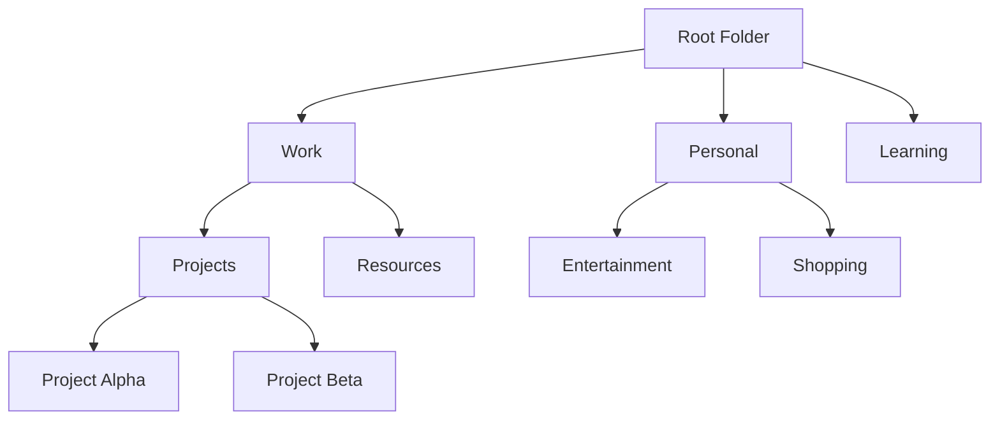

# Folder/Collection System Implementation Plan

## Overview
This document outlines a comprehensive plan for implementing a hierarchical folder/collection system for organizing bookmarks. The system will support nested folders, drag-and-drop functionality, and seamless integration with the existing tag-based organization.

## System Architecture

### Data Model Design
The folder system will use a tree structure with the following components:



### Database Schema Changes

#### New Folder Model
```javascript
const folderSchema = new mongoose.Schema({
  name: { type: String, required: true },
  description: { type: String },
  parent: { 
    type: mongoose.Schema.Types.ObjectId, 
    ref: 'Folder',
    default: null 
  },
  owner: { 
    type: mongoose.Schema.Types.ObjectId, 
    ref: 'User',
    required: true 
  },
  isRoot: { type: Boolean, default: false },
  order: { type: Number, default: 0 },
  color: { type: String, default: '#3B82F6' },
  icon: { type: String, default: 'folder' },
  createdAt: { type: Date, default: Date.now },
  updatedAt: { type: Date, default: Date.now }
});
```

#### Bookmark Model Updates
```javascript
// Add folder reference to existing bookmark schema
folder: { 
  type: mongoose.Schema.Types.ObjectId, 
  ref: 'Folder',
  default: null 
}
```

## Implementation Phases

### Phase 1: Backend Infrastructure
1. **Create Folder Model** - Define and implement the Folder schema
2. **Create Folder Routes** - RESTful API endpoints for folder CRUD operations
3. **Update Bookmark Routes** - Modify existing bookmark endpoints to support folder association
4. **Add Folder Validation** - Ensure proper authorization and data validation
5. **Create Folder Service Layer** - Business logic for folder operations

### Phase 2: Frontend Data Management
1. **Create Folder API Service** - Frontend utilities for folder operations
2. **Update Bookmark API Service** - Extend bookmark API calls to support folders
3. **Create Folder State Management** - React hooks/context for folder data
4. **Add Folder Data Fetching** - Integrate folder loading into app initialization

### Phase 3: UI Components
1. **Create Folder Tree Component** - Hierarchical folder navigation
2. **Create Folder Management UI** - Add/edit/delete folder interfaces
3. **Update Bookmark Components** - Modify forms to include folder selection
4. **Create Folder Breadcrumb** - Navigation trail for current folder path
5. **Add Folder Icons and Colors** - Visual customization options

### Phase 4: Advanced Features
1. **Drag and Drop** - Move bookmarks and folders via drag-and-drop
2. **Folder Search** - Search within specific folders
3. **Bulk Operations** - Move multiple bookmarks to folders
4. **Folder Sharing** - Share entire folders with other users
5. **Smart Folders** - Dynamic folders based on criteria (future enhancement)

## Detailed Implementation Steps

### 1. Database Schema Implementation
- [ ] Create `models/Folder.js` with the folder schema
- [ ] Update `models/Bookmark.js` to include folder reference
- [ ] Create database migration script for existing bookmarks
- [ ] Add indexes for folder queries

### 2. Backend API Development
- [ ] Create `routes/folders.js` with CRUD endpoints
- [ ] Implement GET /api/folders - Get user's folder tree
- [ ] Implement POST /api/folders - Create new folder
- [ ] Implement PUT /api/folders/:id - Update folder
- [ ] Implement DELETE /api/folders/:id - Delete folder (with cascade handling)
- [ ] Update `routes/bookmarks.js` to support folder filtering
- [ ] Add folder validation middleware
- [ ] Implement folder ownership checks

### 3. Frontend Services
- [ ] Create `src/utils/folderApi.js` - Folder API service
- [ ] Update `src/utils/api.js` - Extend bookmark API calls
- [ ] Create `src/hooks/useFolders.js` - React hook for folder data
- [ ] Create `src/contexts/FolderContext.jsx` - Global folder state

### 4. UI Components Development
- [ ] Create `src/components/FolderTree.jsx` - Hierarchical folder display
- [ ] Create `src/components/FolderManager.jsx` - Folder CRUD interface
- [ ] Create `src/components/FolderSelector.jsx` - Folder selection dropdown
- [ ] Update `src/components/AddBookmarkForm.jsx` - Add folder selection
- [ ] Update `src/components/EditBookmarkForm.jsx` - Add folder editing
- [ ] Create `src/components/FolderBreadcrumb.jsx` - Navigation breadcrumbs
- [ ] Create `src/components/FolderActions.jsx` - Folder action buttons

### 5. Integration and State Management
- [ ] Update `src/App.jsx` to include folder context
- [ ] Modify bookmark filtering to support folder-based filtering
- [ ] Add folder-based routing (e.g., /folder/:folderId)
- [ ] Implement folder-based bookmark display
- [ ] Add folder creation from bookmark form

### 6. User Experience Enhancements
- [ ] Add folder creation inline in bookmark forms
- [ ] Implement folder color coding
- [ ] Add folder statistics (bookmark count)
- [ ] Create folder empty state messages
- [ ] Add folder search/filter functionality

### 7. Advanced Features
- [ ] Implement drag-and-drop for bookmark reorganization
- [ ] Add folder move operations (change parent)
- [ ] Create folder templates for common structures
- [ ] Add folder export functionality
- [ ] Implement folder sharing permissions

## API Endpoints Specification

### Folder Endpoints
```
GET    /api/folders              - Get all folders for user (tree structure)
GET    /api/folders/:id          - Get specific folder with bookmarks
POST   /api/folders              - Create new folder
PUT    /api/folders/:id          - Update folder
DELETE /api/folders/:id          - Delete folder (move bookmarks to parent)
GET    /api/folders/:id/bookmarks - Get bookmarks in folder
POST   /api/folders/:id/move     - Move folder to new parent
```

### Updated Bookmark Endpoints
```
GET    /api/bookmarks?folder=:id - Filter bookmarks by folder
POST   /api/bookmarks            - Support folder assignment
PUT    /api/bookmarks/:id        - Support folder reassignment
```

## UI/UX Design Guidelines

### Folder Tree Component
- Collapsible/expandable nodes
- Visual indicators for nested levels
- Context menu for folder actions
- Drag indicators for reordering
- Folder icons with color coding

### Bookmark Display
- Show folder path in bookmark cards
- Filter bookmarks by selected folder
- Show breadcrumbs for navigation
- Empty state for folders without bookmarks

### Folder Management
- Inline folder creation
- Quick folder selection in forms
- Bulk move operations
- Folder search functionality

## Error Handling and Edge Cases

### Data Integrity
- Handle circular folder references
- Prevent deletion of system folders
- Handle orphaned bookmarks when folders are deleted
- Validate folder ownership

### User Experience
- Show loading states for folder operations
- Provide clear error messages
- Confirm destructive actions (folder deletion)
- Handle network failures gracefully

## Testing Strategy

### Backend Tests
- [ ] Unit tests for folder model
- [ ] API endpoint tests
- [ ] Authorization tests
- [ ] Data validation tests

### Frontend Tests
- [ ] Component rendering tests
- [ ] User interaction tests
- [ ] Folder navigation tests
- [ ] Error handling tests

### Integration Tests
- [ ] End-to-end folder creation flow
- [ ] Bookmark assignment to folders
- [ ] Folder deletion with bookmark handling
- [ ] Drag-and-drop functionality

## Migration Strategy

### Existing Bookmarks
- [ ] Create default "Uncategorized" folder for existing bookmarks
- [ ] Migrate existing bookmarks to new structure
- [ ] Update user documentation
- [ ] Provide migration rollback option

## Performance Considerations

### Database Optimization
- Index folder paths for quick traversal
- Cache folder structures
- Optimize nested folder queries
- Implement pagination for large folders

### Frontend Optimization
- Lazy load folder contents
- Virtual scrolling for large lists
- Debounce folder search
- Cache folder data locally

## Security Considerations

### Access Control
- Ensure folder ownership validation
- Implement proper authorization checks
- Validate folder permissions for shared folders
- Prevent unauthorized folder access

### Data Validation
- Sanitize folder names
- Validate folder hierarchy depth
- Prevent path traversal attacks
- Rate limit folder operations

## Future Enhancements

### Smart Folders
- Dynamic folders based on tags
- Date-based auto-folders
- Domain-based grouping
- Usage-based organization

### Advanced Features
- Folder templates
- Folder sharing with permissions
- Folder analytics
- Automated folder organization
- Folder backup/restore

## Implementation Timeline

### Week 1: Backend Foundation
- Database schema updates
- Basic folder API endpoints
- Bookmark model updates

### Week 2: Frontend Integration
- Folder service layer
- Basic folder components
- Folder selection in forms

### Week 3: UI Polish
- Folder tree component
- Drag-and-drop functionality
- Visual enhancements

### Week 4: Testing & Refinement
- Comprehensive testing
- Bug fixes
- Performance optimization
- User feedback integration